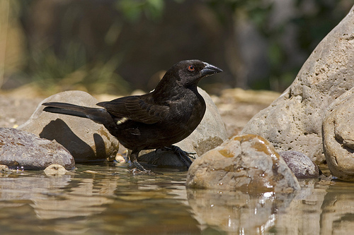

# PatchBench

**Can your vision-language model be patched with expert rules?**

PatchBench is a benchmark for measuring how well a VLM can benefit from
[Dialogic Distillation (DD)](https://github.com/khub-ai/khub-knowledge-fabric) —
a method that improves small models at inference time by injecting expert-authored
visual rules, without any retraining.

A model that scores well on PatchBench is a good candidate for DD deployment:
it can perceive domain-relevant features, follow expert rule instructions, and
give stable answers. A model that scores poorly has a perception barrier that
rules alone cannot fix.

> **Status**: The runner is complete and all three benchmark probes are active.
> Coverage is currently limited — a handful of models tested across three domains.
> Broader conclusions will require results from more models, more domains, and
> larger image sets. **Contributions are welcome**: see [CONTRIBUTING.md](CONTRIBUTING.md).

---

## How it works — a concrete example

Consider this image of a **Bronzed Cowbird** from CUB-200-2011:



Asked to classify it (Bronzed Cowbird vs. Shiny Cowbird), `qwen/qwen3-vl-8b-instruct`
predicts: **Shiny Cowbird**. Wrong. The model fixed on the all-black plumage — shared
by both species — and defaulted to the wrong class.

Now the same question is asked with a rule injected into the prompt:

```
Classify this image as:
  A) Bronzed Cowbird
  B) Shiny Cowbird

CLASSIFICATION RULE: When a small, all-black cowbird shows a conspicuous bright
red or orange-red iris that is clearly visible as a bold colored eye, combined
with a distinctly thick-based, slightly decurved bill that appears heavier and
more robust than a typical icterid bill, identify as Bronzed Cowbird.

PRECONDITIONS (must all be met):
  - Bird is entirely or nearly entirely black-plumaged (male)
  - Iris is visibly bright red or orange-red — not dark brown or black
  - Bill appears notably thick-based and slightly decurved (gonys curved
    downward), giving a heavier, almost grosbeak-like profile compared to
    Shiny Cowbird's slimmer, straighter bill

Apply the rule if preconditions are met; otherwise use your best judgment.

JSON: {"classification": "Bronzed Cowbird" or "Shiny Cowbird", "reasoning": "brief"}
```

The model now predicts: **Bronzed Cowbird**. Correct. The rule told it *what to look
for* — the perceptual capability was there all along.

This rule was generated automatically by the DD process: a TUTOR model analysed the
failure, identified the discriminating features an expert ornithologist would use, and
authored the rule. PatchBench measures how reliably this pattern holds across models
and domains.

*Source: [khub-ai/khub-knowledge-fabric — usecases/image-classification/birds](https://github.com/khub-ai/khub-knowledge-fabric/tree/main/usecases/image-classification/birds)*

---

## Model selection

PatchBench is most useful for **small-to-mid-size VLMs** — models where capability gaps are real and DD-style patching has practical value. Very large models tend to have high baselines that leave little room for rules to show improvement.

When choosing models to test, we prioritise:

- **Vision capability** — the model must accept image input
- **Accessible via API** — OpenRouter or Anthropic-compatible endpoints, so results are reproducible without local GPU infrastructure
- **Range of sizes** — to map where the patchability sweet spot lies
- **Open weights preferred** — results are more useful to the community when others can run, fine-tune, or deploy the same model
- **Deployment economics** — smaller models are cheaper to run at scale, making them attractive for edge deployment, swarm scenarios, or high-volume inference where a larger model would be cost-prohibitive; DD lets them punch above their weight

Proprietary models are included where they provide a useful reference point. Contributions testing additional models are welcome — see [CONTRIBUTING.md](CONTRIBUTING.md).

---

## Quick start

```bash
git clone https://github.com/khub-ai/patchbench
cd patchbench
pip install -r runner/requirements.txt

export ANTHROPIC_API_KEY=sk-ant-...    # for VALIDATOR scoring
export OPENROUTER_API_KEY=sk-or-...    # for your PUPIL model

python run_probe.py --pupil-model qwen/qwen3-vl-8b-instruct
```

That's it. The benchmark images and pre-computed expert outputs are already
in the repo — no dataset download required.

---

## What it measures

Five steps assess a model's readiness for DD in a specific domain:

| Step | What is tested | Who runs it |
|---|---|---|
| 1. Expert vocabulary | Does PUPIL describe domain features spontaneously? | PUPIL |
| 2. Feature detection | Can PUPIL find specific features when asked? | PUPIL |
| 3. Rule comprehension | Does injecting a rule improve accuracy? | PUPIL |
| 4. Consistency | Does PUPIL give stable answers on the same image? | PUPIL |

Steps 1–3 use pre-committed TUTOR (Claude Opus) and VALIDATOR (Claude Sonnet)
outputs — you don't pay for those. Only your PUPIL model is called live.

**Verdict**: `go` / `partial` / `no-go` based on three scores:

| Score | go threshold | no-go floor |
|---|---|---|
| Perception (feature detection accuracy) | ≥ 0.60 | < 0.30 |
| Rule comprehension delta | ≥ +0.15 | — |
| Consistency | ≥ 0.75 | < 0.50 |

---

## Current benchmarks

| Benchmark | Domain | Pair | Images | Status |
|---|---|---|---|---|
| `road_surface_dry_vs_wet_probe_v1` | Road surface | Dry vs Wet asphalt | 24 | ✅ Active |
| `dermatology_melanoma_vs_nevus_probe_v1` | Dermatology | Melanoma vs Nevus | 24 | ✅ Active |
| `birds_bronzed_vs_shiny_cowbird_probe_v1` | Birds | Bronzed vs Shiny Cowbird | 24 | ✅ Active |

---

## Leaderboard

See [leaderboard/leaderboard.md](leaderboard/leaderboard.md).

Submit your result by following the steps in [CONTRIBUTING.md](CONTRIBUTING.md).

---

## Repository structure

```
patchbench/
  run_probe.py               ← main entry point
  runner/
    probe.py                 ← probe logic
    schema.py                ← manifest + result schema
    models.py                ← Anthropic + OpenRouter model calls
    requirements.txt
  benchmarks/
    road_surface/
      dry_vs_wet/
        probe_v1/
          manifest.json      ← image metadata + pre-computed TUTOR/VALIDATOR outputs
          images/            ← 24 JPEG images (CC BY-NC-SA, see DATA_LICENSE.md)
  results/
    road_surface/
      dry_vs_wet/
        qwen3_vl_8b_instruct.json   ← submitted probe results
  leaderboard/
    generate.py              ← rebuild leaderboard from results/
    leaderboard.md           ← rendered leaderboard
  docs/
    getting_started.md
    patchability.md          ← theory: when does DD work?
    probe_design.md          ← technical design of the probe
    contributing_domain.md   ← how to add a new domain
```

---

## Background

PatchBench is built on research from the
[KHub Knowledge Fabric](https://github.com/khub-ai/khub-knowledge-fabric) project,
which demonstrated that expert rules injected at inference time can improve
small VLM accuracy by 30–50 percentage points — without any retraining — in
ornithology (CUB-200-2011) and dermatology (HAM10000).

The key question PatchBench answers: *which models can benefit from this?*

For the full theoretical background, see
[docs/patchability.md](docs/patchability.md).

---

## License

**Code**: MIT — see [LICENSE](LICENSE)

**Benchmark images**: Included from source datasets under their original
licenses. See [DATA_LICENSE.md](DATA_LICENSE.md) for per-domain attribution.

---

## Citation

If you use PatchBench in published work, please cite:

```bibtex
@software{patchbench2026,
  title   = {PatchBench: A Benchmark for VLM Patchability via Dialogic Distillation},
  author  = {KHub AI},
  year    = {2026},
  url     = {https://github.com/khub-ai/patchbench},
}
```
